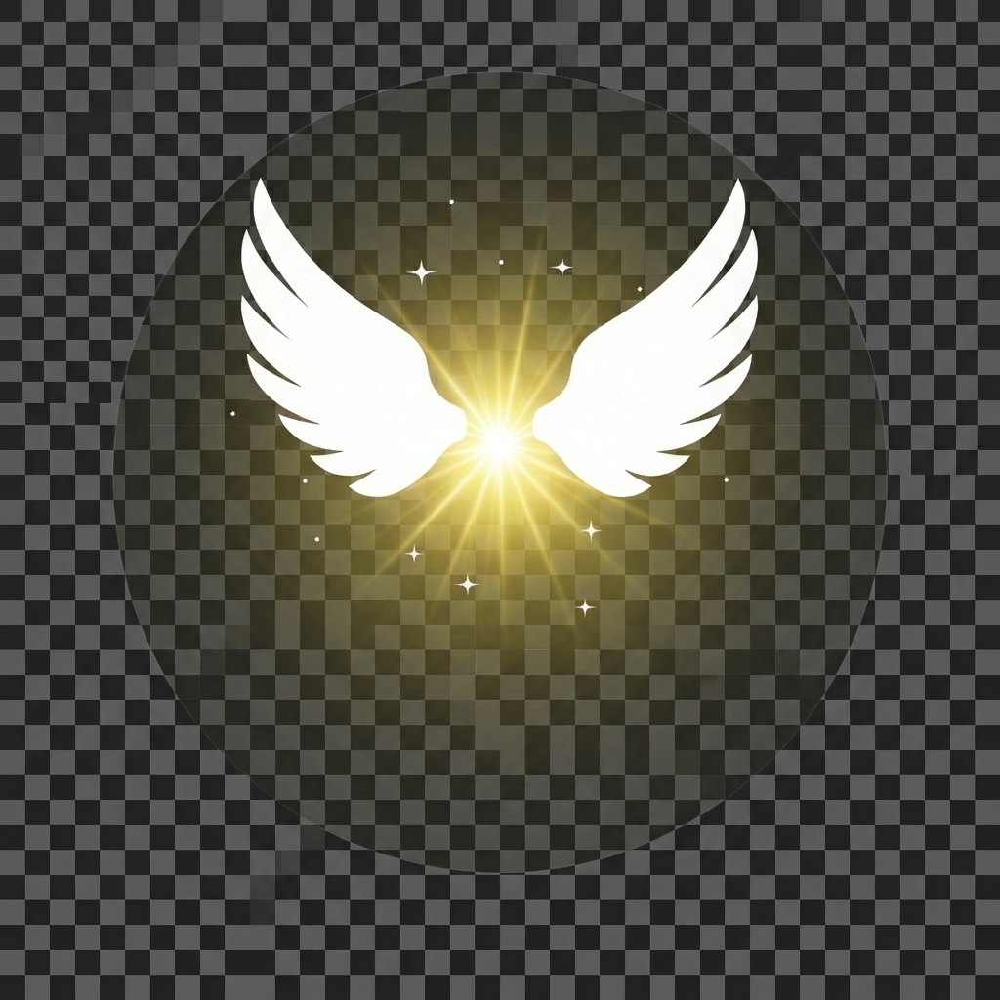

<p align="center">
  
</p>

<h1 align="center">ManiFriends</h1>
<p align="center">✨ Peri temalı multiplayer oyun portalı ✨</p>

<p align="center">
  <a href="https://manifriends.com">🌐 Canlı Demo</a>
</p>

---

## 🎮 Oyunlar

| Oyun | Açıklama | Mod |
|------|----------|-----|
| **Fairy Fusion** | Suika benzeri birleştirme oyunu | Solo |
| **Fairy Hockey** | Air hockey | Solo / Online PvP |

## 🛠 Teknolojiler

- **Frontend:** Vanilla HTML, CSS, JavaScript
- **Backend:** Firebase Realtime Database
- **Fizik:** Matter.js (Fusion)
- **Hosting:** Netlify

## 📁 Yapı

```
manifriends/
├── index.html          # Ana portal
├── hockey/             # Fairy Hockey
├── fusion/             # Fairy Fusion  
├── js/                 # Oyun mantığı
└── assets/             # Görseller
```

## 🚀 Kurulum

```bash
# Klonla
git clone https://github.com/mertsurucu1/manifriends.com.git

# Herhangi bir local server ile çalıştır
npx serve .
```

---

<p align="center">Made with 💜</p>
